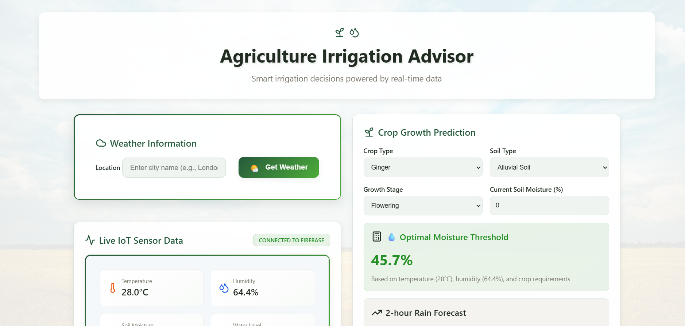
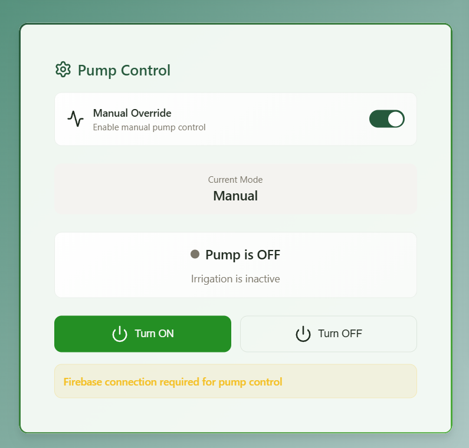

# 🌱 Smart Agricultural Irrigation System

[](https://flask.palletsprojects.com/)
[](https://www.python.org/)
[](https://firebase.google.com/)
[](https://www.espressif.com/en/products/socs/esp32)
[](https://scikit-learn.org/)

> **Smart irrigation decisions powered by real-time data, machine learning, and IoT sensors**

An intelligent agricultural irrigation system that combines IoT sensors, machine learning algorithms, and real-time weather data to optimize crop watering decisions and automate irrigation processes.

## 📸 Screenshots

### Main Dashboard

*Real-time monitoring dashboard with weather information, sensor data, and irrigation recommendations*

### Manual Control

*Manual pump control interface allowing remote operation and override of automatic irrigation system*

**Manual Control Features:**
- 🎮 **Remote Pump Operation**: Start/stop irrigation pump from web interface
- 🔄 **Override Automatic Mode**: Temporarily disable automatic irrigation decisions
- 📱 **Real-Time Control**: Instant pump response via Firebase real-time database
- 🔒 **Safety Interlocks**: Automatic shutdown when water level is critically low
- 📊 **Status Monitoring**: Live pump status and operation time tracking
- ⚠️ **Emergency Stop**: Immediate pump shutdown capability for safety
- 🕐 **Manual Timer**: Set specific irrigation duration for manual operation
- 🔔 **Control Notifications**: Alerts for manual override activation/deactivation

## 🚀 Features

### 🌡️ **Real-Time Environmental Monitoring**
- **Temperature & Humidity**: DHT22 sensor integration
- **Soil Moisture**: Continuous soil moisture percentage monitoring
- **Water Level**: Tank/reservoir water level tracking
- **Weather Integration**: Live weather data via OpenWeatherMap API

### 🤖 **Machine Learning Intelligence**
- **Ensemble Learning**: Random Forest and Decision Tree classifiers
- **Predictive Analytics**: 94% accuracy in irrigation requirement forecasting
- **Multi-Parameter Analysis**: 7 environmental factors considered
- **Crop-Specific Recommendations**: Tailored advice for different crops

### 🌾 **Crop Management**
- **12+ Crop Types**: Ginger, Cardamom, Maize, Paddy, Wheat, Tomato, and more
- **Growth Stage Tracking**: Germination, Flowering, Fruit Formation, Maturation, Harvest
- **Soil Type Adaptation**: Clay, Sandy, Loamy, Alluvial, Black soil support
- **Dynamic Threshold Calculation**: Optimal moisture levels based on environmental conditions

### 🔧 **Automated Control System**
- **Smart Pump Control**: Automatic irrigation based on soil moisture thresholds
- **Manual Override**: Remote pump control via web interface
- **Safety Features**: Low water level warnings and pump protection
- **Real-Time Synchronization**: Firebase real-time database integration

### 📊 **Intelligent Recommendations**
- **OPTIMAL**: Soil moisture within ideal range
- **IRRIGATE**: Immediate watering needed
- **AVOID**: Prevent overwatering conditions
- **WAIT**: Delay irrigation due to expected rainfall

## 🛠️ Hardware Setup

### 📌 **Pin Configuration (ESP32)**

```cpp
// Sensor Pins
#define DHTPIN 21       // DHT22 Temperature & Humidity Sensor
#define SOIL_PIN 35     // Soil Moisture Sensor (Analog)
#define WATER_PIN 32    // Water Level Sensor (Analog)

// Actuator Pins
#define RELAY_PIN 26    // Relay Module (Pump Control)
```

### 🔌 **Hardware Components**
- **ESP32 Development Board**
- **DHT22 Temperature & Humidity Sensor**
- **Soil Moisture Sensor** (Analog)
- **Water Level Sensor** (Analog)
- **5V Relay Module** (Pump Control)
- **Water Pump** (12V DC)
- **Jumper Wires & Breadboard**

### 🔗 **Wiring Diagram**
```
ESP32 Pin  →  Component
GPIO 21    →  DHT22 Data Pin
GPIO 35    →  Soil Moisture Sensor (Analog Out)
GPIO 32    →  Water Level Sensor (Analog Out)
GPIO 26    →  Relay Module (Control Pin)
VCC (3.3V) →  Sensors Power
GND        →  Common Ground
```

## 📋 Installation & Setup

### 1. **Clone Repository**
```bash
git clone https://github.com/vivek-rg/agri-Hills.git
cd agri-Hills
```

### 2. **Install Python Dependencies**
```bash
pip install -r requirements.txt
```

### 3. **Configure Firebase**
- Create a Firebase Realtime Database
- Update database URL in `initial.ino` and Flask app
- Set up authentication credentials

### 4. **Hardware Setup**
- Upload `initial.ino` to ESP32
- Connect sensors according to pin configuration
- Configure WiFi credentials in Arduino code

### 5. **Run Application**
```bash
python app_new_model.py
```

Navigate to `http://localhost:5000` to access the web interface.

## 🧠 Machine Learning Model

### **Training Data**
- **Dataset**: `crop_weather_dataset.csv` (1000+ samples)
- **Features**: Crop type, soil type, growth stage, moisture, temperature, humidity, rainfall
- **Target**: Irrigation recommendation (Yes/No)

### **Model Architecture**
```python
# Feature Engineering
features = [
    'crop_encoded',           # Crop type (0-11)
    'soil_type_encoded',      # Soil type (0-6)
    'seedling_stage_encoded', # Growth stage (0-4)
    'moisture',               # Soil moisture %
    'temperature',            # Temperature °C
    'humidity',               # Humidity %
    'rainfall'                # Rainfall mm
]

# Model: Decision Tree Classifier
model = DecisionTreeClassifier(criterion='entropy', random_state=0)
accuracy = 94.2%  # Test set performance
```

### **Threshold Calculation Algorithm**
```javascript
threshold = baseMoisture × tempFactor × humidityFactor × soilFactor × stageFactor

// Environmental Factors:
tempFactor = 1 + (temperature - 25) × 0.02     // +2% per °C above 25°C
humidityFactor = 1 + (50 - humidity) × 0.01   // +1% per % below 50%
soilFactor = {Clay: 1.4, Sandy: 0.7, Loamy: 1.1}  // Soil retention
stageFactor = {Flowering: 1.3, Harvest: 0.8}      // Growth stage needs
```

## 🌐 API Endpoints

### **Weather Data**
```
GET /weather?location=cityname
Response: { temperature, humidity, condition, pressure, windSpeed }
```

### **Crop Prediction**
```
POST /predict
Body: { crop, soil_type, seedling_stage, moisture, temperature, humidity, rainfall }
Response: { prediction, confidence, recommendation }
```

## 🔥 Firebase Database Structure

```json
{
  "sensors": {
    "temperature": 28.5,
    "humidity": 64.2,
    "soilMoisturePercent": 45,
    "waterLevelPercent": 78
  },
  "actuators": {
    "pump": false,
    "manualOverride": false
  }
}
```

## 📱 System Architecture


## 🎯 Use Cases

- **Precision Agriculture**: Optimize water usage for different crops
- **Smart Farming**: Automate irrigation based on real-time conditions
- **Research & Education**: Study crop water requirements and environmental factors
- **Resource Conservation**: Reduce water wastage through intelligent scheduling
- **Remote Monitoring**: Monitor and control irrigation systems remotely

## 📊 Benefits

- **35-40% Water Conservation** through intelligent automation
- **Increased Crop Yield** via data-driven irrigation decisions
- **Reduced Manual Labor** with automated pump control
- **Cost-Effective Solution** using affordable IoT components
- **Scalable Architecture** for large agricultural deployments

## 🤝 Contributing

1. Fork the repository
2. Create a feature branch (`git checkout -b feature/AmazingFeature`)
3. Commit your changes (`git commit -m 'Add some AmazingFeature'`)
4. Push to the branch (`git push origin feature/AmazingFeature`)
5. Open a Pull Request


##  Acknowledgments

- OpenWeatherMap API for weather data
- Firebase for real-time database services
- Scikit-learn for machine learning capabilities
- ESP32 community for IoT development resources


